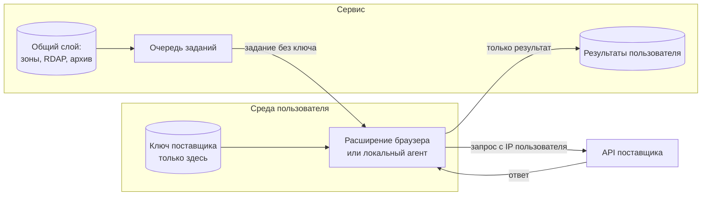

# Сервис дроп-доменов: запросы пользователя — с его IP и его ключом

Проект, 09.09.2026. Решение руководителя: регистратором и владельцем
источника выступает сам пользователь — он подключает свой ключ доступа, и
средства лежат на его балансе. Документ доводит это решение до схемы, в
которой у сервиса физически нет возможности связать аккаунты пользователей
между собой.

Повод — `reports/seo/drop-domain-data-sources.md`: постоянная блокировка
аккаунта в группе TurnCommerce с формулировкой «несколько аккаунтов,
связанных с одним лицом». Схема ниже устроена так, чтобы такую формулировку
нельзя было применить ни к сервису, ни к его пользователям.

---

## 1. Принцип, из которого выводится всё остальное

**Кто платит поставщику — тот к нему и обращается.** Запрос, оплачиваемый
балансом пользователя, выполняется в среде пользователя: его IP, его ключ,
его учётная запись. Сервер сервиса такие запросы не проксирует и ключей не
получает.

Из принципа следуют два слоя данных, и разделение между ними — главное
архитектурное решение.

| Слой | Кто выполняет запрос | Чей IP | Чей аккаунт | Где хранится результат |
|---|---|---|---|---|
| **Общий** — зон-файлы CZDS, RDAP, Wayback, официальные списки освобождающихся, публичные агрегаторы | сервер сервиса | сервиса | сервиса (свой, легитимный, один) | в базе сервиса, доступен всем пользователям |
| **Персональный** — платные ссылочные API, кабинет регистратора, заявки на перехват, аукционы | клиент пользователя | пользователя | пользователя | у пользователя; в сервис попадает только то, что он сам отправил |

Общий слой — это то, что дорого собирать каждому по отдельности и дёшево
собрать один раз: он и есть продукт. Персональный слой — то, что нельзя
собирать за пользователя, не создавая ровно того риска, из-за которого
написан этот документ.

## 2. Кто исполняет персональный запрос

Три возможных исполнителя, оценка по одним и тем же критериям:

| Исполнитель | IP запроса | Где ключ | Что умеет | Вердикт |
|---|---|---|---|---|
| **Расширение браузера** | пользователя, домашний или офисный | в хранилище расширения, сервер не видит | ходит к любому API без ограничений CORS, работает, пока открыт браузер | основной путь для разовой работы и кабинетов регистратора |
| **Локальный агент** (CLI или контейнер у пользователя) | пользователя | в конфиге агента на его машине | регулярные прогоны по расписанию, работа без браузера, большие выгрузки | основной путь для мониторинга и объёмных задач |
| **Выделенный выход на стороне сервиса** | сервиса, хоть и отдельный на пользователя | у сервиса | не требует ничего от пользователя | запасной вариант с явным предупреждением: адрес всё равно принадлежит инфраструктуре сервиса, и поставщик вправе считать такие обращения связанными |

Веб-страница без расширения третьим вариантом не является: браузер не даст
обратиться к чужому API из скрипта страницы, если поставщик не разрешил CORS,
а большинство не разрешает. Обходить это через прокси сервиса — значит
вернуться ровно к той схеме, от которой уходим.

## 3. Жизненный цикл ключа

1. **Подключение.** Пользователь вводит ключ в расширении или агенте. Ключ
   не отправляется на сервер ни при подключении, ни позже.
2. **Подтверждение владения.** Клиент вызывает у поставщика самый дешёвый
   служебный метод (профиль, лимиты, баланс) и показывает пользователю имя
   аккаунта и остаток. Смысл двойной: пользователь видит, что подключил
   именно свой ключ, а сервис получает подтверждение без доступа к ключу.
3. **Что хранит сервер.** Отпечаток ключа (хеш), имя поставщика, дату
   подключения, показанное имя аккаунта, статус. По отпечатку сервис
   отвечает на два вопроса — «ключ подключён» и «это тот же ключ, что вчера»
   — и ни на один больше.
4. **Использование.** Сервер ставит задание в очередь; задание описывает,
   что нужно узнать, и не содержит ключа. Клиент забирает задание, исполняет
   своим ключом, возвращает результат.
5. **Отзыв.** Удаление ключа в клиенте немедленно прекращает исполнение
   заданий. Ранее полученные результаты остаются у пользователя и выгружаются
   в файл — они его, а не сервиса.

Правило одного ключа: одна учётная запись сервиса — один ключ на поставщика.
Попытка подключить второй ключ того же поставщика отклоняется с прямым
объяснением: несколько аккаунтов одного лица у одного поставщика — это то,
за что аккаунты блокируют.

## 4. Почему схема выгодна обеим сторонам

| | Что получает пользователь | Что получает сервис |
|---|---|---|
| Деньги | платит поставщику по своему тарифу, без наценки за перепродажу запросов | не выкупает данные и не замораживает оборотные средства в чужих лимитах |
| Риск | его аккаунт не связан с чужими: блокировка соседа его не касается | нет мультиаккаунтного риска, нет единой точки, потеря которой останавливает всех |
| Данные | исходники и лимиты остаются у него, уходит — уходит с данными | хранит производные и скоринг, то есть свою часть ценности |
| Секреты | ключ не покидает его среду | не хранит чужие секреты — нечего утекать и не за что отвечать |
| Право | сам соблюдает условия своего поставщика | не обещает того, что не может гарантировать за чужой аккаунт |

Ценность сервиса при этом не размывается, а становится честной: он продаёт
не доступ к чужому API, а общий слой и вычисления над ним — свод дропов по
зонам, история и архив, скоринг кандидата по модели, мониторинг и
оповещения. Это то, что работает и у пользователя без единого платного
ключа, и то, что невозможно собрать в одиночку.

## 5. Ограничения и как они закрываются

| Ограничение | Решение |
|---|---|
| Клиент выключен, а прогон по расписанию нужен | задание живёт в очереди до подключения клиента; регулярный мониторинг — сценарий локального агента, а не браузера |
| Лимиты поставщика на ключ пользователя | очередь и backoff на стороне клиента, дедупликация заданий, ответы общего слоя не запрашиваются у платного поставщика повторно |
| Пользователь подключил чужой ключ | подтверждение владения из пункта 3 показывает имя аккаунта; согласие при подключении фиксирует, что ключ его и условия поставщика он соблюдает |
| Условия поставщика запрещают вызовы из стороннего приложения | проверка до подключения, а не после жалобы: список поставщиков с отметкой «разрешено вызывать ключом владельца» ведётся в реестре сервиса |
| Разные результаты у разных пользователей по одному домену | это нормально: индексы поставщиков расходятся. В интерфейсе у каждого числа указан источник и чей ключ его дал |

## 6. Чего схема не делает — намеренно

Она не прячет пользователя от поставщика и не помогает обходить блокировки.
Никакой ротации адресов, подмены отпечатка клиента и «чистых» прокси: клиент
представляется своим именем и версией, запросы идут с обычного адреса
пользователя, а если поставщик заблокировал человека — сервис не даёт ему
способ вернуться под другим именем. Это не только правовая позиция, но и
практическая: схема ценна ровно тем, что каждый участник действует от себя,
и именно это делает её устойчивой к тому, что случилось с NameBright.

## 7. Приёмка

Перед запуском проверяется, что:

1. В сетевых журналах сервера нет ни одного исходящего обращения к платным
   API поставщиков — только общий слой.
2. Ни в базе, ни в логах, ни в очереди заданий не встречается значение
   пользовательского ключа; поиск по отпечатку находит только хеш.
3. Удаление ключа в клиенте останавливает исполнение заданий, а выгрузка
   результатов остаётся доступной.
4. Попытка подключить второй ключ того же поставщика отклоняется.
5. У каждого числа в интерфейсе виден источник и дата.

## 8. Что решает руководитель

С какого клиента начинать — расширение браузера или локальный агент. Оба
нужны, но первым делается один; выбор определяет, какой сценарий сервис
закрывает в первой версии: разовый разбор кандидата или регулярный
мониторинг.

---

*Смежное: `reports/seo/drop-domain-data-sources.md` (замена источников после
блокировки), `reports/server/load-analysis-2026-09-05.md` (размещение сервиса
и требование «чистого» IP), `docs/rules/data-sources-registry.md` (реестры
источников и аккаунтов).*
